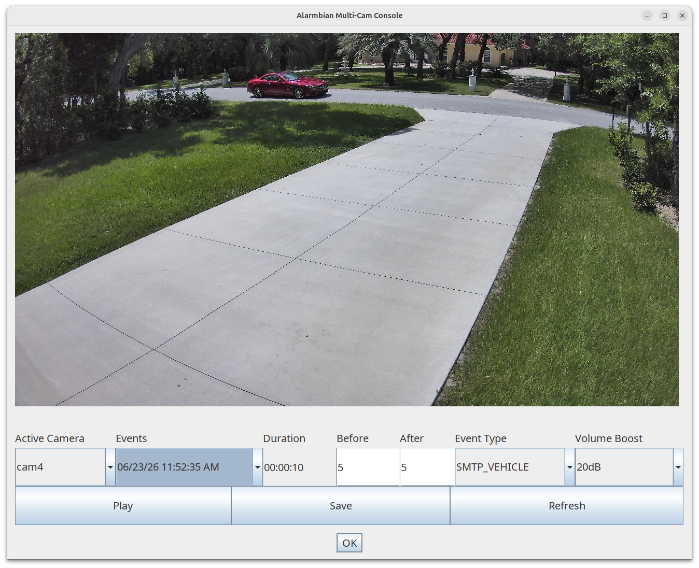

Alarmbian is a high-performance, cross-platform DIY NVR and edge-analytics framework designed to turn single-board computers (SBCs), low-power mini PCs, or repurposed desktop hardware into a resilient surveillance grid. Built on a lean, native stack of Java, MediaMTX, FFmpeg, and OpenCV, it is optimized for Linux environments (tested on Ubuntu 24.04) while remaining highly portable due to its Java-centric core.

## The Architectural Reality: Zero-Overhead Metadata vs. Centralized Processing

While modern NVR architectures like Blue Iris and Frigate have adopted "Direct-to-Disc" stream copying to save high-resolution main streams without transcoding, they still rely on a **heavy, centralized processing loop** for event detection and classification. To continuously track objects (humans, cars, animals), these traditional setups force the central server to decode live streams 24/7 through a resource-hungry machine learning pipeline, requiring dedicated hardware accelerators (like Coral TPUs) or high-wattage desktop processors just to keep up.

Alarmbian flips this paradigm by eliminating centralized object classification entirely, dividing cameras into two highly optimized, independent pipelines:

* **Edge-AI Cameras (Zero-Decoding Metadata Receiver):** For modern smart cameras, Alarmbian completely offloads both motion detection and object classification to the edge. The camera's on-board AI chip handles 100% of the spatial analysis natively at the lens. When a human, vehicle, or pet is identified, the camera fires an instantaneous, text-based alert or snapshot to Alarmbian's embedded SMTP server. The central server catches this metadata trigger and flags the archive without ever decoding a single video frame for analysis.
* **Legacy Cameras (Lightweight OpenCV Motion Isolation Only):** For older cameras lacking native intelligence, Alarmbian provides a defensive fallback loop using OpenCV to decode the low-resolution sub-stream feed—**solely for pixel-level motion detection, never for object classification.** To prevent CPU spikes, Alarmbian utilizes strict frame-rate boundaries and recycles pre-allocated native memory buffers. It reuses the exact same byte arrays frame after frame, keeping host CPU cache lines clean.
* **Zero-Overhead Main Stream Pass-Through:** Regardless of the camera type, the high-resolution 4K main stream bypasses the detection logic entirely. Raw network packets are written straight to storage controllers via MediaMTX/FFmpeg stream-copy templates without intermediate rendering steps or memory bus transactions.

## Proven Capabilities & Key Features

* **Bare-Metal Hardware Efficiency:** Proven to handle six continuous 4K H.265+ streams at 15 FPS on a low-power, 2GB RAM ARM-based ODROID-XU4 over a standard USB 3.0 storage bridge.
* **Embedded SMTP Event Server:** Includes an integrated, high-speed mail routing server that allows edge-AI cameras to pipe snapshot and classification alerts straight into the application logic, bypassing sluggish polling intervals.
* **Isolated Sub-Stream Motion Detection:** Features an ultra-lean OpenCV decoding pipeline dedicated strictly to pixel-level motion tracking for non-AI feeds, keeping the host free from expensive machine learning calculations.
* **Native Stream Pass-Through:** Ingests and saves raw H.264, H.265+, or any advanced codec profile supported by the native FFmpeg layer without modifying a single video packet.
* **Smart Motion Summaries:** Generates custom "History Images" that compress an entire chronological motion sequence into a single, scannable composite frame for rapid event triage without scrubbing through hours of footage.
* **Decoupled User Interface:** Features a dedicated Java-based UI to seamlessly review localized event databases, visualize motion histories, and play back raw archived video segments.

## The Ultimate DIY Paradigm

This framework is built for engineers who demand total control over their infrastructure. Because there are infinite ways to compile and optimize FFmpeg, fine-tune native OpenCV JNI/FFM boundaries, or target specialized acceleration flags for deep learning extensions, optimized deployment is entirely up to you. Alarmbian provides a bulletproof, zero-overhead pipeline; you choose exactly how to weaponize the underlying hardware.
## Install FFMPEG
Install hardware acceleration libraries like Cuda before running script.
* `cd ~/alarmbian/scripts`
* `./install-ffmpeg.sh`

## Install Supervisor
Supervisor will be used to start all the jobs up required for Alarmbian. We
will place all logs in ~/logs. Make sure you edit individual conf files and change
`username` to your actual username.
* `cd`
* `mkdir logs`
* `sudo apt install supervisor`

## Install MediaMTX
It makes sense to centralize camera streams and minimize traffic from the cameras.
MediaMTX makes this happen. Cameras like the Annke C800 only allow one
connection to the substream, so a proxy is required. Substreams are used for
analysis and live viewing, so more than one stream at a time is required.
* `cd`
* [Download](https://github.com/bluenviron/mediamtx/releases) latest .tar.gz file to the home directory
* `cd`
* `tar -xf mediamtx*`
* `rm *.tar.gz`
* `nano mediamtx.yml`
* Edit `paths` section to specify your substreams
* `./mediamtx`
* Test proxy on client
* ^C to exit

Add Supervisor job
* Reference [configuration](scripts/supervisor/mediamtx.conf)
* `sudo nano /etc/supervisor/conf.d/mediamtx.conf`
* `sudo supervisorctl update`
* Test proxy on client
* Check logs dir for issues

## Clone project
* `cd`
* `git clone --depth 1 https://github.com/sgjava/alarmbian.git`

## Install Java
* `cd ~/alarmbian/scripts`
* `./install-java.sh`

## H2 database
H2 is used to store data from the Alarmbian application. Other data stores could
be used as well with configuration and schema.sql changes,
* `cd`
* [Download](http://www.h2database.com/html/download.html) latest jar file (use Binary JAR link)
* Example `wget -O h2-2.4.240.jar https://search.maven.org/remotecontent?filepath=com/h2database/h2/2.4.240/h2-2.4.240.jar`
* `java -cp h2*.jar org.h2.tools.Server -baseDir ~/ -tcp -web -ifNotExists -tcpAllowOthers`
* Start another shell on same machine
* `java -cp h2*.jar org.h2.tools.Shell -driver org.h2.Driver -url jdbc:h2:tcp://localhost/nio:test -user sa -password sa`
* `quit`
* `ls -al test.mv.db`
* ^C to exit server shell
* `rm test.mv.db`

Add Supervisor job
* Reference [configuration](scripts/supervisor/h2.conf)
* `sudo nano /etc/supervisor/conf.d/h2.conf`
* `sudo supervisorctl update`
* Test H2 client
* Check logs dir for issues

## Install OpenCV
Modify script to customize install for hardware acceleration, etc.
* `cd ~/alarmbian/scripts`
* `./install-opencv.sh`

## Build project
* `cd ~/alarmbian`
* `mvn initialize -Pinstall-opencv`
* `mvn clean install`
* `cp server/target/server-1.0.0-SNAPSHOT.jar ~/.`
* `cp server/target/smtp-1.0.0-SNAPSHOT.jar ~/.`
* `cd`
* `sudo supervisorctl start h2`
* `sudo supervisorctl start mediamtx`
* Use [application.properties](https://raw.githubusercontent.com/sgjava/alarmbian/refs/heads/main/server/src/main/resources/application.properties)
to make your cam1.properties configuration (repeat for each camera using unique file name)
* `java -Djava.library.path=/home/username/opencv/build/lib -jar server-1.0.0-SNAPSHOT.jar --spring.config.location=cam1.properties`
* ^C to exit app
* If you see a SIGSEGV don't worry because ^C will not be used for shutdown.
Add Supervisor job (repeat for each camera using unique file name)
* Reference [configuration](scripts/supervisor/cam1.conf)
* `sudo nano /etc/supervisor/conf.d/cam1.conf`
* `sudo supervisorctl update`
* Check logs dir for issues
Add Supervisor job
* Reference [configuration](scripts/supervisor/smtp.conf)
* `sudo nano /etc/supervisor/conf.d/smtp.conf`
* `sudo supervisorctl update`
* Check logs dir for issues

## Play UI
Play UI is a [UiBooster](https://github.com/Milchreis/UiBooster) based UI that uses OpenCV and ffplay to view events and play videos.
You can set before and after seconds to see what was before and after event. You can also save event as video. While you can play
videos from currently recording files there will be no index until file is closed. Thus, it will take longer to seek to event.

* `sudo apt install sshfs`
* `sudo mkdir /mnt/data1` or whatever local dir you want to use
* `sudo chown username:username /mnt/data1` change username to your local user
* `sshfs servadmin@192.168.1.99:/data1/ /mnt/data1` change ip, remote and local dirs as needed
* `cd alarmbian` this assumes you compiled project on the UI machine
* Use [application.properties](https://raw.githubusercontent.com/sgjava/alarmbian/refs/heads/main/client/src/main/resources/application.properties) to make your own client.properties
* `java -Djava.library.path=/home/username/opencv/build/lib -Dspring.config.location=file:cam1.properties -jar client/target/client-1.0.0-SNAPSHOT.jar`
